# CarService — приложение для учёта технического обслуживания автомобилей

Учебный проект

Данный проект разработан в учебных целях в рамках курсовой работы. Приложение является демонстрационным и создано для отработки навыков проектирования и разработки клиент-серверных мобильных приложений с использованием Kotlin, Jetpack Compose, Ktor и PostgreSQL.

Проект не предназначен для использования в коммерческих целях и не проходил полноценного production-тестирования. Часть решений (структура API, обработка ошибок, безопасность) упрощена в учебных целях и может не соответствовать требованиям реальных промышленных систем.

Клиент-серверное мобильное приложение для автосервисов, специализирующихся на брендах группы **VAG** (Volkswagen, Audi, Škoda, SEAT, Cupra, Porsche, Lamborghini). Приложение позволяет сотрудникам автосервиса создавать заявки на техническое обслуживание, отслеживать их статус и вести профиль пользователя.

## Содержание

- [Описание](#описание)
- [Функциональность](#функциональность)
- [Стек технологий](#стек-технологий)
- [Архитектура](#архитектура)
- [Скриншоты](#скриншоты)
- [Тестирование](#тестирование)
- [Репозитории](#репозитории)

## Описание

Приложение автоматизирует процесс учёта технического обслуживания автомобилей в специализированном автосервисе: от приёма заявки до выдачи автомобиля клиенту. Разработано в рамках курсовой работы.

## Функциональность

- регистрация и авторизация сотрудников через Firebase Authentication;
- создание заявок с указанием бренда, модели, года выпуска, пробега и перечня работ;
- отображение списка заявок с текущим статусом («В работе» / «Готов к выдаче»);
- отметка выполненных работ с автоматическим обновлением статуса заявки;
- удаление заявок;
- профиль пользователя (имя, возраст, должность, филиал);
- поддержка тёмной темы (Material Design 3).

## Стек технологий

| Слой | Технологии |
|---|---|
| Клиент | Kotlin, Jetpack Compose, Navigation Compose, Retrofit, Room |
| Сервер | Ktor, Exposed, HikariCP |
| База данных | PostgreSQL (Neon.tech) |
| Аутентификация | Firebase Authentication |

## Архитектура

Приложение построено на принципах **Clean Architecture** с разделением на слои: Presentation (Composable-экраны, ViewModel), Data (репозитории, Retrofit/Room, DTO) и Domain (модели Car, User).

**Диаграмма вариантов использования (Use Case):**

`diagrams/use_case_diagram.png`

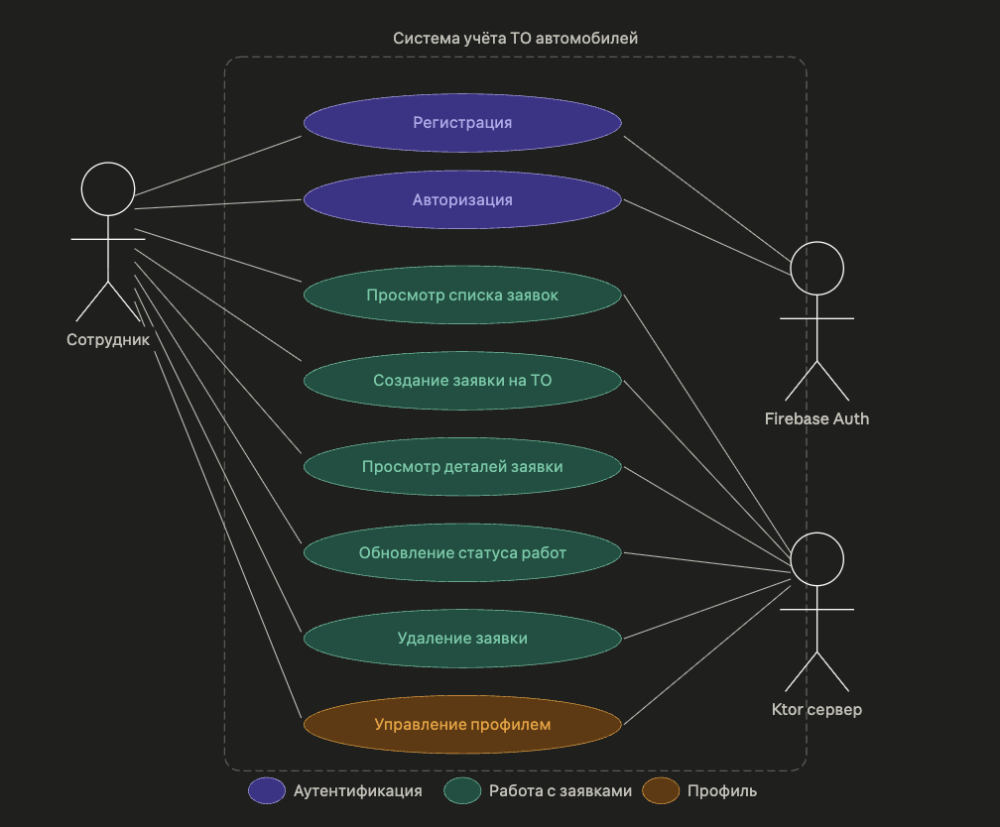

**Диаграмма классов:**

`diagrams/class_diagram.png`

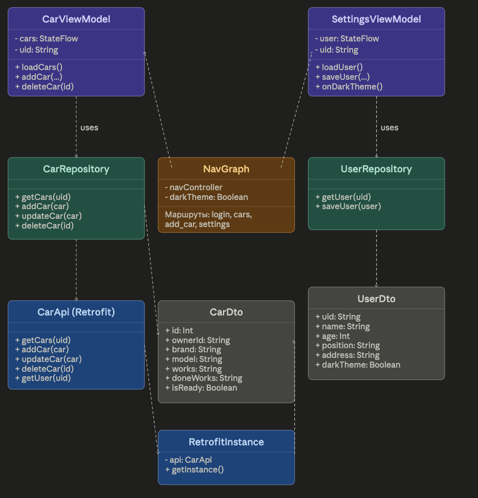

**Диаграмма IDEF0 (функциональная модель процесса):**

`diagrams/idef0_diagram.png`

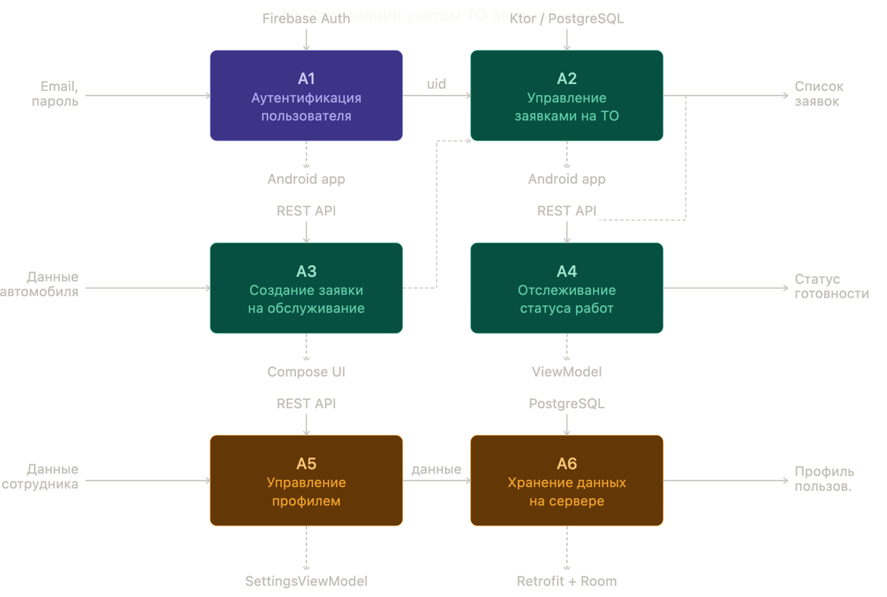

**Логическая модель базы данных** (таблицы `cars` и `users`, связь по `owner_id` ↔ `uid`):

`diagrams/db_schema.png`

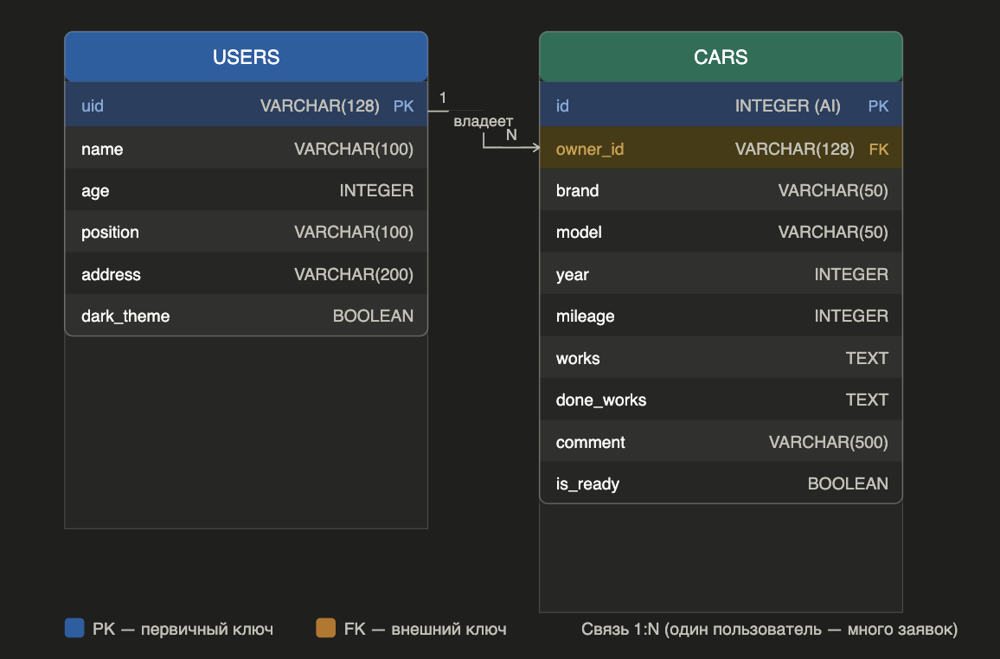

## Скриншоты

| Экран | Изображение |
|---|---|
| Авторизация | `screenshots/login_1.png` |
| Регистрация | `screenshots/register.png` |
| Главный экран (список заявок) | `screenshots/main_list_1.png` |
| Создание заявки | `screenshots/add_car.png` |
| Детальная информация о заявке | `screenshots/car_detail_1.png` |
| Настройки / профиль | `screenshots/settings.png` |

  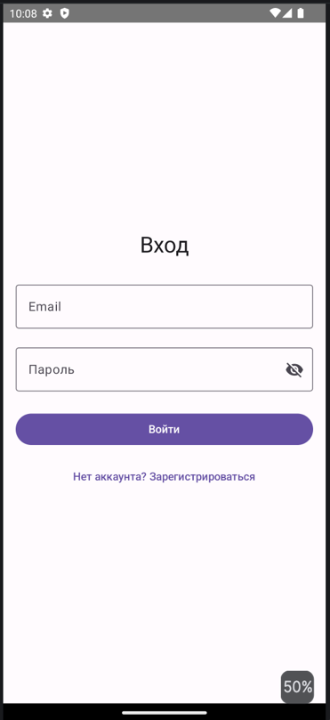
  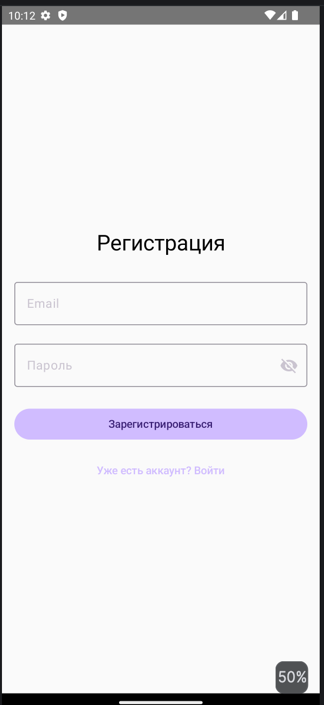
  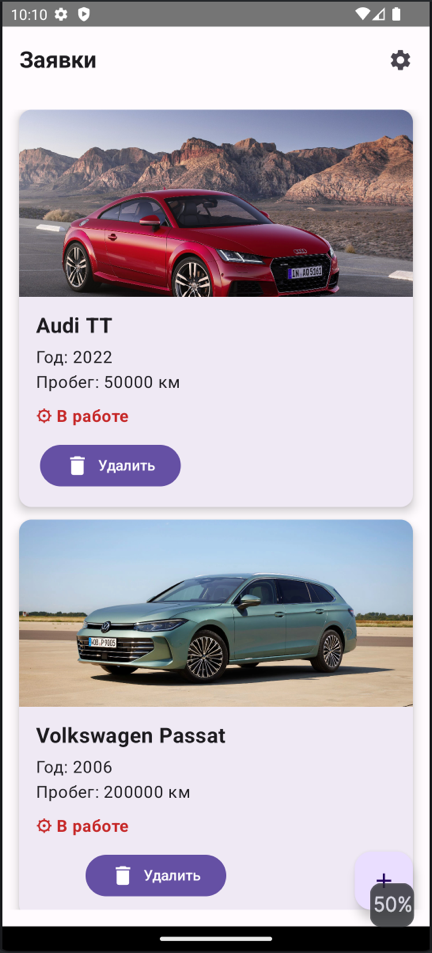

  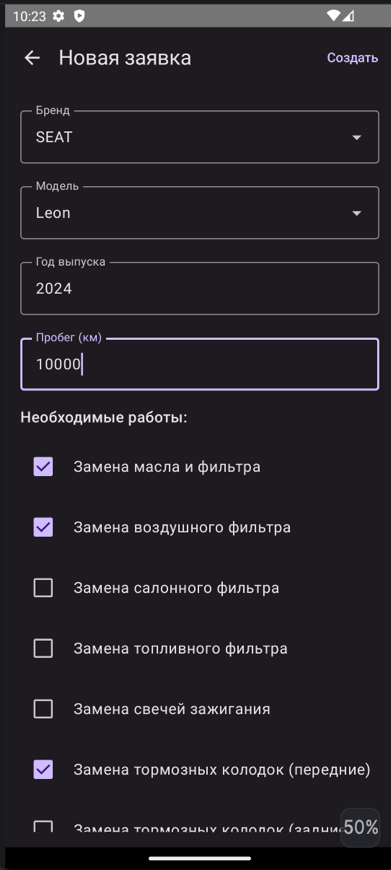
  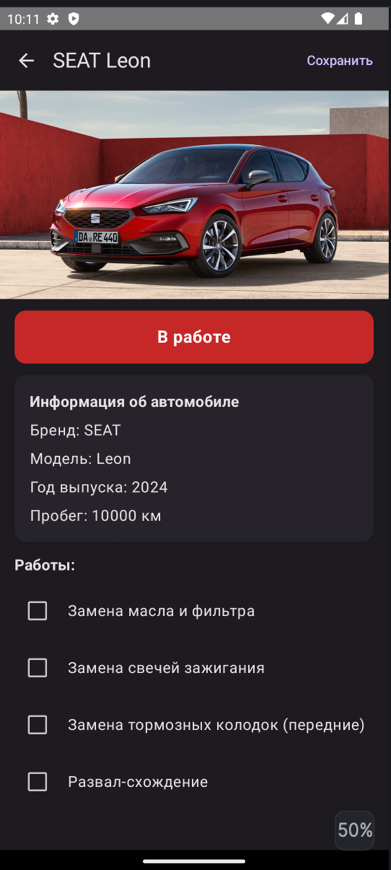
  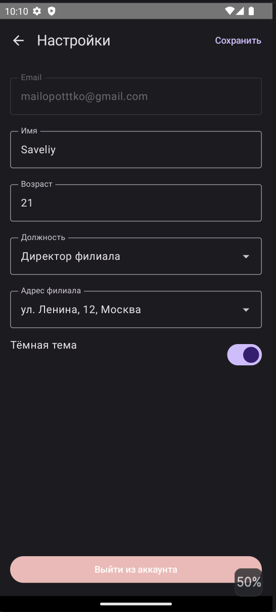

## Тестирование

Проведено модульное тестирование (unit) и инструментальное UI-тестирование.

**Результаты модульного тестирования (10 тестов, все пройдены успешно):**

`screenshots/unit_tests_results.png`

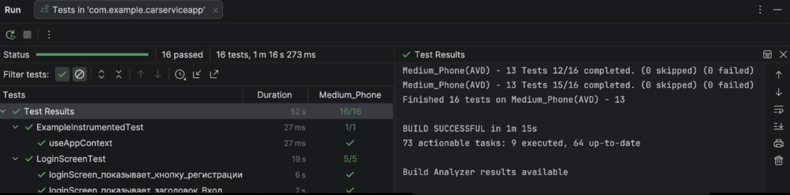

**Результаты UI-тестирования (16 тестов):**

`screenshots/ui_tests_results.png`

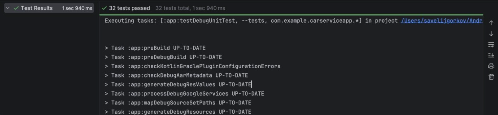

## Репозитории

- Клиентская часть (Android): https://github.com/CloudVHS/CarService-client-
- Серверная часть (Ktor): https://github.com/CloudVHS/CarService-server-
